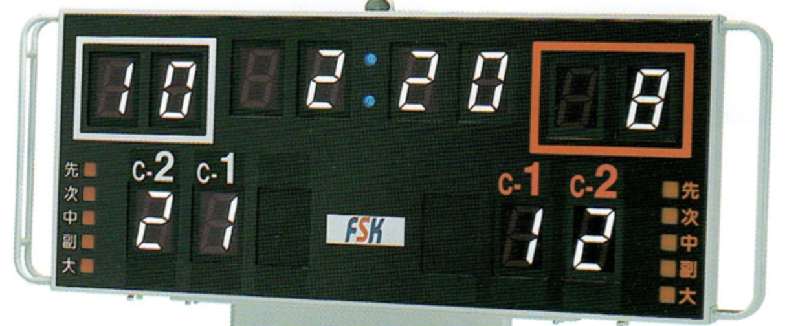

# Karate score board

With this, you no longer need to buy KARATE score board.

## Tested Environment
- macOS
- python 3.7.2

## Usage

1. git clone

`git clone https://github.com/rika77/KARATE_score_board.git`

2. Run

`python3 main.py`

## Future work

- Make it available on web
- New score board for team competetions

